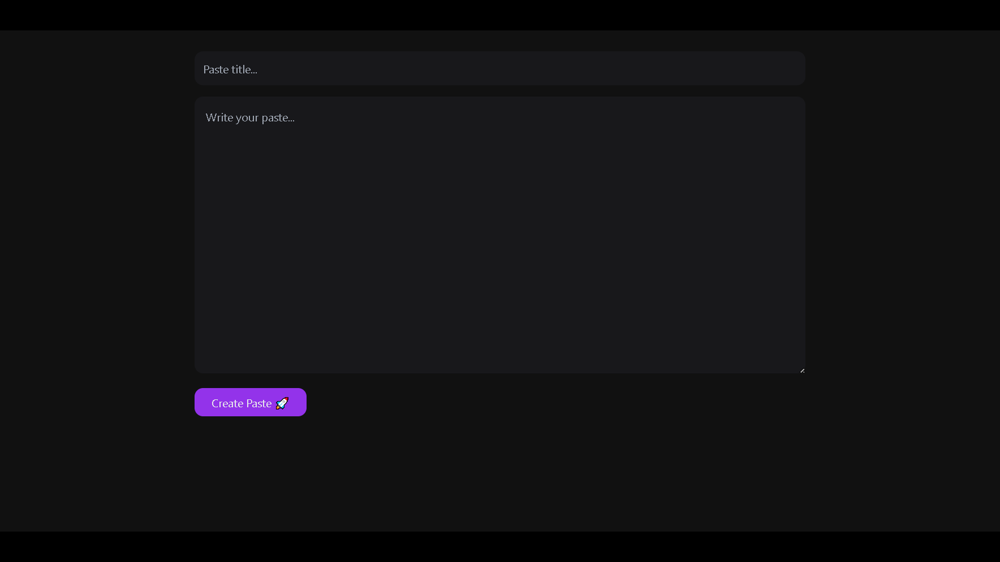
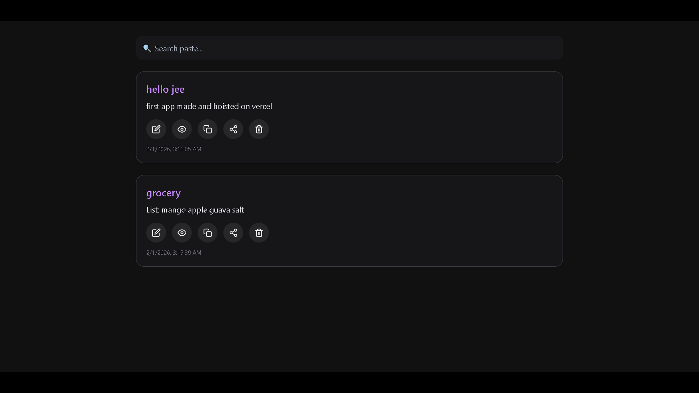
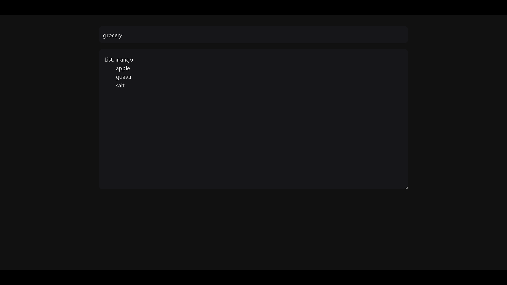

# 📝 Notes Saver App

A clean, modern, and lightweight **Notes / Paste Saver application** built using **React, Redux Toolkit, React Router, and Tailwind CSS**.

The app allows users to **create, edit, view, search, copy, share, and delete notes**, with persistent storage using the browser’s `localStorage`.

---

## 🚀 Live Demo

<<<<<<< HEAD
👉 (https://notes-saver-app.vercel.app/ )
=======
👉 **https://notes-saver-app.vercel.app**

---

## 📸 Screenshots

### 🏠 Home – Create & Edit Notes


### 📋 Pastes – View & Manage Notes


### 👁️ View – Read-only Mode

>>>>>>> 48e937a (Update README with screenshots and improvements)

---

## ✨ Features

- ✏️ Create new notes / pastes  
- 📝 Edit existing notes  
- 👁️ View notes in read-only mode  
- 🔍 Search notes by title  
- 📋 Copy notes to clipboard  
- 🔗 Share notes using Web Share API  
- 🗑️ Delete notes  
- 💾 Persistent storage using `localStorage`  
- 🎨 Clean & aesthetic UI  
- 📱 Fully responsive layout  

---

## 🔄 Application Flow

     User Action
         ↓
   React Component
         ↓
  Redux Action Dispatch
         ↓
 Redux Store Update
         ↓
UI Re-render + localStorage Sync


### Example Flow:
1. User creates or edits a note
2. Component dispatches a Redux action
3. Redux slice updates global state
4. Updated state is saved to `localStorage`
5. UI re-renders automatically

## 🏗️ Architecture Overview
┌─────────────┐
│ Navbar │
└─────┬───────┘
│
┌─────▼────────────┐
│ React UI │
│ Home | Pastes │
│ ViewPastes │
└─────┬────────────┘
│
┌─────▼────────────┐
│ Redux Toolkit │
│ pasteSlice.js │
└─────┬────────────┘
│
┌─────▼────────────┐
│ Redux Store │
│ store.js │
└─────┬────────────┘
│
┌─────▼────────────┐
│ localStorage │
└──────────────────┘

## 🛠️ Tech Stack

- **React**
- **Redux Toolkit**
- **React Router DOM**
- **Tailwind CSS**
- **React Icons**
- **Vite**
- **localStorage**
- **Vercel (Deployment)**

---

## 📦 Local Setup

```bash
git clone https://github.com/RYUGA02/Notes-Saver-App.git
cd Notes-Saver-App
npm install
npm run dev